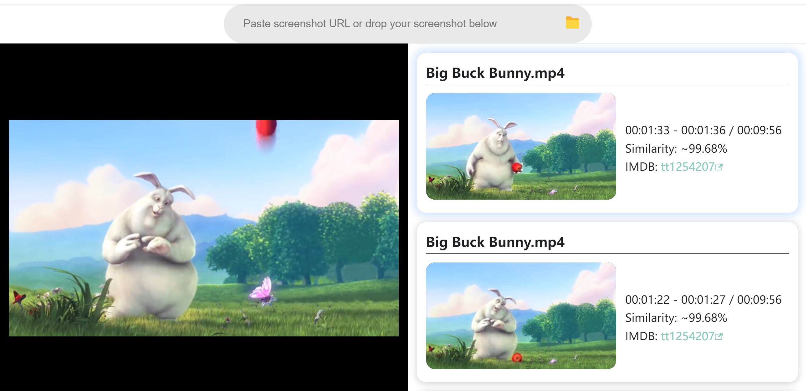

<p align="center">
  <a href="https://shotit.github.io/" target="_blank" rel="noopener noreferrer">
    
  </a>
</p>
<br/>
<p align="center">
  <a href="https://github.com/shotit/shotit-api"></a>
  <a href="https://github.com/shotit/shotit-api"></a>
  <a href="https://github.com/shotit/shotit-media"></a>
  <a href="https://github.com/shotit/shotit-worker"></a>
  <a href="https://github.com/shotit/shotit-sorter"></a>
</p>
<br/>

# Shotit ⚡

Shotit is a screenshot-to-video search engine tailored for TV & Film, blazing-fast and compute-efficient.



## Quick Start 🚀

Docker Compose is required, Please install it first.

Minimum workload: 2v16G, 4v32G preferred.

```
git clone https://github.com/shotit/shotit.git
cd shotit
```

- Copy `.env.example` to `.env`
- Edit `.env` as appropriate for your setup, as is for the first time.
- Copy `milvus.yaml.example` to `milvus.yaml`
- Edit `milvus.yaml` as appropriate for your setup, as is for the first time.

Create these necessary folders.

```
mkdir -p volumes/shotit-hash
mkdir -p volumes/shotit-incoming
mkdir -p volumes/shotit-media
mkdir -p volumes/mycores
mkdir -p volumes/mysql
```

Set the user and group information of `mycores` to 8983, required by `liresolr`. 

```
sudo chown 8983:8983 volumes/mycores
```

Then, up docker-compose services.

```
(Windows or Mac):
docker compose up -d
(Linux):
docker-compose up -d
```

Once the cluster is ready, you can add your video files to the incoming folder. Take Blender's Big Buck Bunny as an example, whose imdb tag is tt1254207, the path should be:

```
./volumes/shotit-incoming/tt1254207/Big_Buck_Bunny.mp4
```

Restart `shotit-worker-watcher`, in case it doesn't catch the change of your files.

```
docker restart shotit-worker-watcher
```

When `shotit-worker-watcher` detects the existence of video files in the incoming folder, it would start uploading the videos to object-storage powered `shotit-media`. After the upload, the videos would be eliminated, then `shotit-worker-hasher` creates hash and `shotit-worker-loader` loads the hash to vector database. Use the following command to see whether the index process has been completed: 
```
docker logs -f -n 100 shotit-worker-loader
```

When the index process completes, you will notice a `Loaded tt1254207/Big_Buck_Bunny.mp4` log and you can search the videos by screenshot directly from the URL below. 

```
GET http://127.0.0.1:3311/search?url=https://i.ibb.co/KGwVkqy/big-buck-bunny-10.png
```

Response:

```
{
    "frameCount": 0,
    "error": "",
    "result": [
        {
            "imdb": "tt1254207",
            "filename": "Big_Buck_Bunny.mp4",
            "episode": null,
            "from": 473.75,
            "to": 479.17,
            "similarity": 0.9992420673370361,
            "video": "http://127.0.0.1:3312/video/tt1254207/Big%20Buck%20Bunny.mp4?t=476.46000000000004&now=1682985600&token=kc64vEWHPMsvu54Fpl1BrR7wz8",
            "image": "http://127.0.0.1:3312/image/tt1254207/Big%20Buck%20Bunny.mp4.jpg?t=476.46000000000004&now=1682985600&token=K0qxDPHhoviiexOyEvS9qHRim4"
        }
    ]
}
```

**Congratulations!** You have successfully deployed your `shotit` search engine.

Notice: the first time of api call should be longer since shotit has to load hash completely into RAM first.

## Documentation 📖

Please see [here](https://shotit.github.io/) for full documentation on:

- Getting started (installation, hands-on demo guide, cloud-native S3 configuration)
- Reference (full API docs, limitation)
- Resources (explanation of core concepts)

## Architecture ⛪

### In a nutshell

`Shotit` is composed of these docker images.

| Docker Image           | Docker CI Build | Image Size |
| ---------------------- | --------------- | ---------- |
| [shotit-api](https://github.com/shotit/shotit-api)| [](https://github.com/shotit/shotit-api/actions) | [](https://hub.docker.com/r/lesliewong007/shotit-api) |
| [shotit-media](https://github.com/shotit/shotit-media) | [](https://github.com/shotit/shotit-media/actions) | [](https://hub.docker.com/r/lesliewong007/shotit-media) |
| [shotit-worker-watcher](https://github.com/shotit/shotit-worker)  | [](https://github.com/shotit/shotit-worker/actions) | [](https://hub.docker.com/r/lesliewong007/shotit-worker-watcher) |
| [shotit-worker-hasher](https://github.com/shotit/shotit-worker)   |  [](https://github.com/shotit/shotit-worker/actions) | [](https://hub.docker.com/r/lesliewong007/shotit-worker-hasher) |
| [shotit-worker-loader](https://github.com/shotit/shotit-worker)   |  [](https://github.com/shotit/shotit-worker/actions) | [](https://hub.docker.com/r/lesliewong007/shotit-worker-loader) |
| [shotit-worker-searcher](https://github.com/shotit/shotit-worker) |  [](https://github.com/shotit/shotit-worker/actions) | [](https://hub.docker.com/r/lesliewong007/shotit-worker-searcher) |
| [shotit-sorter](https://github.com/shotit/shotit-sorter)          |   [](https://github.com/shotit/shotit-sorter/actions) | [](https://hub.docker.com/r/lesliewong007/shotit-sorter) |
| [liresolr](https://github.com/Leslie-Wong-H/liresolr) | | [](https://hub.docker.com/r/lesliewong007/liresolr) |
| [minio](https://min.io/) |                 | [](https://hub.docker.com/r/minio/minio) |
| [etcd](https://etcd.io/)            |                 |  [](https://quay.io/coreos/etcd:v3.5.0) |
| [mariadb](https://mariadb.org/)                |           | [](https://hub.docker.com/r/_/mariadb) |
| [adminer](https://www.adminer.org)                |        | [](https://hub.docker.com/r/_/adminer) |
| [redis](https://redis.io/)                  |         | [](https://hub.docker.com/r/_/redis) |
| [milvus-standalone](https://milvus.io/)      |         | [](https://hub.docker.com/r/milvusdb/milvus) |

### Go deeper


### Deep dive


## Benchmarks

| Dataset | Episode number | Vector volume |  Search time |
| ---------------------- | --------------- |  ---| --- | 
| [Blender Open Movie](https://studio.blender.org/films/) | 15 | 55,677 | within 5s |
| Proprietary genre dataset | 3,734 | 53,339,309 | within 5s |


## Live Demo


[https://shotit.github.io/shotit-frontend/demo](https://shotit.github.io/shotit-frontend/demo)


## Acknowledgment

`Shotit` significantly adopts its system design pattern from [trace.moe](https://github.com/soruly/trace.moe). The vision of `Shotit` is to make screenshot-to-video search engine genre-neutral, ease-of-use, compute-efficient and blazing-fast.

## Contribution

See [Contributing Guide](https://github.com/shotit/shotit/blob/main/CONTRIBUTING.md).

## License

[Apache-2.0](https://github.com/shotit/shotit/blob/main/LICENSE)
